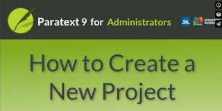

:::note Video
  
https://vimeo.com/793640292

[**Overview pdf**](https://drive.google.com/file/d/19bgfOpStfN2hOL6UsniCtZgcDEEHCzZz/view?usp=share_link) [**Actions srt**](https://drive.google.com/file/d/1KSg2xONYsSm_2rTY5sWNvFE4FRYZSrjt/view?usp=share_link)

**Opening Screen** anything!  
- Uses text slide from previous video
- Text to translate
  - Greyed out!
  - Match base or local commonly used translation
  - Paratext 8
- Callout arrows (to translate)
  - 1. Type
  - 2. Based on
  - 3. Language
  - 4. Names
  - 5. Versification
  - 6. Books
  - 7. USFM 3 or 2

- **Details for new Project**
  - you will need to choose a project name, the ISO code for that language. 
  - you also want the language names and versification
