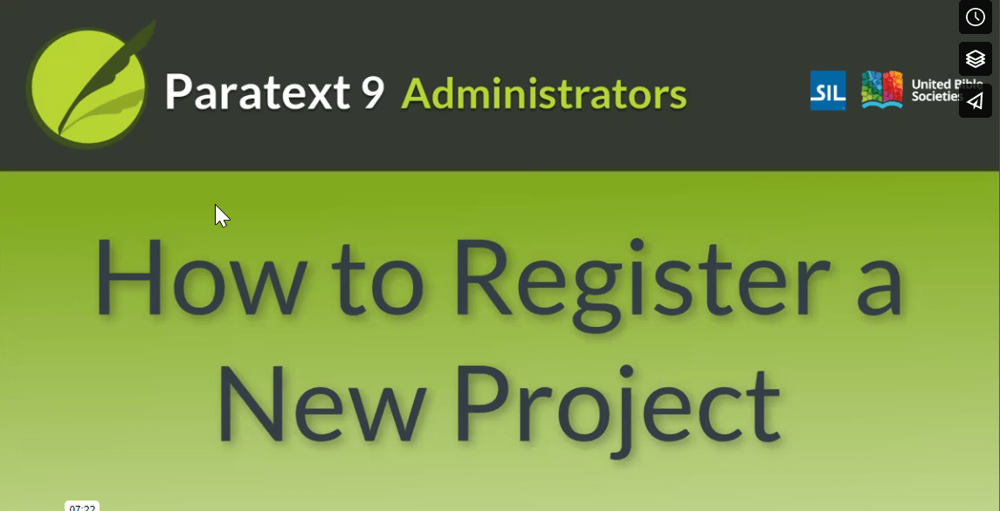

:::note Video
  
https://vimeo.com/796285090
:::

[**Overview pdf**](https://drive.google.com/file/d/1JGg6y_Fw7ETkx8LAStJyH0Nh-ZYCC9uH/view?usp=share_link) [**Actions srt**](https://drive.google.com/file/d/1JGg6y_Fw7ETkx8LAStJyH0Nh-ZYCC9uH/view?usp=share_link)

**Opening screen** New project (unregistered) from previous video open (with resources on one side and project on the other)

- **Text** 

  - Uses text slide from previous video  
Text to translate:
  - the text that you will paste into the four comment fields
  - Callout: Help the registration reviewer by completing these optional fields!
  - Callout: Visible to people logged in to Paratext registry
  - Add to previous callout: & have access to your organization’s registrations.

- **Details**  
This video goes through the register new project form. It starts in Paratext, goes to the registry on the web to complete the form and finished back in Paratext.
  - You will need to decide on the answers for  your new project.
  - When choosing the **Translation type**, you leave it as **New**.
the choose **Revision** to show extra files and then go back to **New**.
