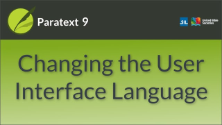
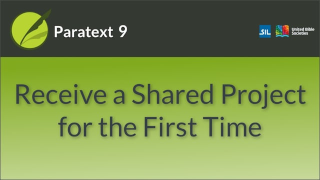
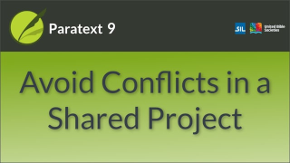

There are at least 24 introductory videos. These notes have been prepared to help you localise the videos. 

:::tip
Most if not all of the videos in the Introduction can be done with any project. 
:::

## Intro P9
#### - 0.01a	How the Windows Work 1
#### - 0.01b	How the Windows Work 2
These two videos (0.01a+0.01b) have been split. See Navigation below 0.2.1 and 0.2.2.

### - 0.02	Why Change the menus
This video is no longer relevant to most of our viewers. It relates problems on earlier versions of Paratext.

### \# 1 - 0.0.3	Quick Guide to Quick Reference
:::note Video
  
https://vimeo.com/403437931
:::

Click for [**Overview pdf**](https://drive.google.com/file/d/1SBxP9lKlIpd33bf5pk-GpKX6kxKRBogP/view?usp=sharing)  / [**Actions srt**]   
- **Opening screen**  
- **Prep**:   
  - several \r reference lines
  - a reference in a footnote

## Introduction

### \# 2 -	0.1	What is Paratext (0.1)
:::note Video
  
https://vimeo.com/472226946
:::

:::caution
This is a detailed video with 11 chapters showing most of the functions. It is best to leave it until last, That way you will have prepared suitable projects and may have footage to reuse.
:::
Click for [**Overview pdf**](https://drive.google.com/file/d/1ok7ixl6bgQ0FRKhDiJVIGuz82iXCW3Lg/view?usp=sharing)  / [**Actions srt**](https://drive.google.com/file/d/1kJtG2lAwPn-4IbdWfbmJqRSkStnLgdCm/view?usp=sharing) /
[**Summary**](https://manual.paratext.org/Video-summaries/Introduction/0.1)
- **Opening screen** Acts 1:3 project, Greek source text (no interlinear lines) enhanced resource with another resource in tab, text collection (5 resources).  
- **Prep**:  
  - Text to translate for slides
       - Paratext is the premier software for Bible translation. 10,000+ Active users. 
       - Planning Managing Drafting Reviewing Checking 2,300+ Language projects. 
       - My Cursor
       - Manuel's Cursor
       - Annual reports, Websites, novels, Business Letters, Health pamphlets, Bible
       - This is worked extremely awkwardly according to Manuel.
  -  Websites 
      - paratext.org/terms-of-use website
      - paratext.org (site has changed) click Getting Started then Downloads
      -  extensions.libreoffice.org click on dictionary

  
0-**Intro**
  - Right-click a greek word in Source language text, show lexeme
  - Paratext menu > Download resources, click to turn off show resources...
  - transition to Paratext website - terms of agreement (Paratext is Free)
  
1-**Project plan** setup transition to Mark 4:29
  -  Project plan setup - (base plan alreay applied)
  -  Define priorities - set several priorities
  -  Project plan blue button, have some tasks already assigned
  -  Back to project - error when typing
     -  Make sure you don't have permission for Mark 4 but another book is editable. 
     - need to errors to correct

2-**Project notes** - add note (see text above)
  -  Project plan - errors from project notes
  -  Checks (several errors ch/v, markers)
  -  duplicated verse (caused by typo in 3:24)
  -  verse number in heading
  -  verse missing (3:24) space between 2 4 

3-**Resources**
  - Open another source lanuage text (make sure  source text is not selected when first open)
  - **Enhanced resources**  Mrk 4:28
   -  hover over word for 'harvest' in your language or another word with multiple senses
  Enhanced resource in autohide.

4-**Windows layouts**: 
  -  several windows open to drag around
  -  several shared layouts, one using a resource that is not available
 
5-**Collaboraton**: A second user who can edit the text is needed for the PT live demonstration.

6-**Parallel passages**: Mat 5:13

7-**Biblical terms**: Mat 5:24 verse range set to current section. rendering for kingdom

8-**Spell check**: several words with previous corrections to apply

9-**Back translation**: Mat 13 completed, Act 1 (no back translation) type back translation for verse 1, then v2, edit text get ? compare
  -  Interlinear Act 1:1 - change a gloss, correct a gloss, approve gloss

10-**Help and Training**: Search "Bibli"
  -  Shows video ~~portfolios~~ for various languages - change to training videos?? https://paratext.org/videos/ 

11-**Register and download**
  -  Paratext.org  Get Started then Registration 
  - Downloads.
 

### \# 3 - 0.2.1a How To Change The User Interface Language (0.2.1a)
:::note Video
  
https://vimeo.com/368328819
:::

Click for [**Overview pdf**](https://docs.google.com/spreadsheets/d/1cGMmFm7l19GTHg7vvKA1bQMjRRCfKacJ/edit?usp=sharing&ouid=103165771678697843902&rtpof=true&sd=true)
 [Actions.srt](https://drive.google.com/file/d/1hEjpYx-P-NpScsRiBwO-kadRXR7Ga-Ty/view?usp=sharing) 
[**Summary**](https://manual.paratext.org/Video-summaries/Introduction/0.2.Navigation/0.2.1a) 
- **Opening screen**  Any passage in standard view
- **Prep**: 
  - You can use **any project** for this video.
  - You need to decide which language to start with.  
    -  Since Paratext asks you to choose the interface language on installation, your viewers may already be in your language. So it may be better to start in your language and then change to English.

## Navigation
### \# 7 -	0.2.1b	The Basics Of Projects And Resources (0.2.1b)
:::note Video
  
https://vimeo.com/368328862
:::

 [**Overivew**](https://drive.google.com/file/d/1KBFsgSD-XV3C278c7Xo3gKpRY8khACeg/view?usp=sharing)  / [**Actions srt**](https://drive.google.com/file/d/1hEjpYx-P-NpScsRiBwO-kadRXR7Ga-Ty/view?usp=sharing)  
- **Opening screen**: Mat, with proj + 2 res as panels  
- **Prep** 
  - you need permission to edit Matthew but not Mark
  - you will use the Open menu (so check which filters are chosen - Project, Resources and Source Language Texts)
  - you will Close Paratext
  - restart from Desktop (so clean up your desktop!)

### \# 8 - 0.2.1c	Finding Menu Items (0.2.1c)
:::note Video
  
https://vimeo.com/425476264
:::

[**Overview pdf**](https://drive.google.com/file/d/1Z3ADSZ1uGaFBL0Hzj1ZwR7B-rrcRhWaa/view?usp=sharing)  / [**Actions srt**]  
- **Opening screen**: Mat 1:6 project on left, 2nd col 3 res/res res Biblical terms   
- **Prep**: none   
- **Project**: any??

### \# 9 - 0.2.1d	How To Arrange Windows (0.2.1d)
:::note Video
  
https://vimeo.com/368328956
:::

[**Overview pdf**](https://drive.google.com/file/d/1XgF88AYJcwdz89SKQ5nj0-0riR_CnQxW/view?usp=sharing)  / [**Actions srt**](https://drive.google.com/file/d/1suyguV5hxTU7dEGT_RMBoIRLeFLLjfdK/view?usp=sharing)  
- **Opening screen**  Mat 1
- **Prep**: 
-   First part 
    - Show a **Good** arrangement of
    - Mat 1:  Windows open: project, several resources (tabs and pane), biblical terms renderings.
    - two items in Autohide (e.g. dictionary)
    - one floating window (? Greek text)
  - Second part
    - Start with **Messy** arrangement of windows
    - 5 windows in columns  
  Project, dictionary, two resources, notes list

Notes from script:
- Open five or six windows, the PTP and multiple resources. Have one of each type of Window display. (Include NRSV, HBKENG)
Avoid opening an enhanced resource, as the line between the text and the research pane may look confusingly like the border between projects when arranging panels.  

:::caution
Susanna failed to record the screen actions in a way which worked with this script so she ended up having to change the script. The order of teaching planned here is probably superior though, so if a localizer can achieve it like this, all the better!
::: 

### \# 10 - 0.2.2a	How To Open And Modify A Text Collection (0.2.2a)
:::note Video
  
https://vimeo.com/377612892
:::

:::info Changes in Paratext 9.3
There are now 2 ways to access Text collection  in P9.3
:::

[**Overview pdf**](https://drive.google.com/file/d/1-rqlz4tOVSb5ES7Jx68COne6KnsbG4wP/view?usp=sharing)  / [**Actions srt**](https://drive.google.com/file/d/1mPh2P6MR1xhAR4OqScJpiSpY5ud3c52M/view?usp=sharing)  
- **Opening screen**  
- **Prep**: 
  - I’m starting from the “PTP with 6 resources” layout saved in the video on Arranging windows. I have closed the floating window for simplicity. 

  - Video starts with a text collection already open, then later closes it and shows how to open.
  - go to "Open" and check that Resources and Source language texts are the only buttons selected.
  - choose several resources to add to the text collection

### \# 11 - 0.2.3a	How To Control Which Windows Scroll Together (0.2.3a)
:::note Video
  
https://vimeo.com/382483908
:::

[**Overview pdf**](https://drive.google.com/file/d/1jbpIh6trm8cKwi6d5hM1UW3N1dGhIUPS/view?usp=sharing)  / [**Actions srt**](https://drive.google.com/file/d/1oPg8ZoNNe5N5sFEaU9aXwsInPWTp_97c/view?usp=sharing)  
- **Opening screen**: Heb 10:1 with several resources open as panels.
- **Prep**
  - Your project needs to have both OT and NT books
    - you need an NT book with an OT quotation, e.g. Heb 10 + Jer 31:51 or Psa 8:3 and Mat 21.6
  - you need to open and drag several panes
  - you will use scroll groups 

### \# 12 - 0.2.3b	How To Set The Default Keyboard For A Project (0.2.3b)
:::note Video
  
https://vimeo.com/427651172
:::

[**Overview pdf**](https://drive.google.com/file/d/1WtLhl3VA_VQV0vX7nvX39h3XLZ-Ym2Yi/view?usp=sharing)  / [**Actions srt**](https://drive.google.com/file/d/19DCo-dFmBvcQgccrP4mZzDquOZpSNN_F/view?usp=sharing)  
- **Recording area**: You will need to capture the Keyman icon on the taskbar
- **Opening screen**  2 projects, two resources (one needing Keyman)
- **Prep**: 
  - Annotation text to translate: 
    - This computer and this user ONLY
  - Have a Paratext project open requiring a non-default keyboard, as well as PTP. 
  - To use the Fulfulde project as described in the script, restore the backup file FTP and install the keyman keyboard fulfunik7 from the shared drive resources folder.
  - Screenshot of Keyman configuration showing that you have a keyboard installed

### \# 13 - 0.2.3c	How To Swap A Text In A Window (0.2.3c)
:::note Video
  
https://vimeo.com/377612971
:::

[**Overview pdf**](https://drive.google.com/file/d/1zU0XVu9A0zGDCeAfetXs3uHl8BUQsoUo/view?usp=sharing)  / [**Actions srt**](https://drive.google.com/file/d/1DPz5SA4tSyYelGhrVC399Beg1jTnqoq5/view?usp=sharing)  
- **Opening screen**  Mat 1:1, project + 3 resources/ notes, dictionary in autohide,
- **Prep**: 
  - choose a 4th resource to change to
  - make sure you have a saved layout 
  - other windows to have open: Biblical terms windows, enhanced resource

### \# 14 - 0.2.3d	Further Tips On Arranging Windows (0.2.3d)
:::note Video
  
https://vimeo.com/377613013
:::

[**Overview pdf**](https://drive.google.com/file/d/1kSawCCWITwaJbcNclhsEUEH01HDf4VqI/view?usp=sharing)  / [**Actions srt**](https://drive.google.com/file/d/1Jnq4zDeLJIjChrtycp585Tj02jHZiznf/view?usp=sharing)  
- **Recording screen**: you need to include the taskbar
- **Opening screen**: Continues from 0.2.1d	*How To Arrange Windows*
- **Prep**: 
  - **Title slides to translate**  
  Tip1: How to swap windows  
  Tip 2: How to undo moving a window  
  Tip 3: How to unpin floating windows  
  Tip 4: How to widen the autohide column  
  Tip 5: How to undo closing a window  
  Summary
  - Title screen from the previous video "How to Arrange Windows"
  - screenshots of Paratext menu showing undo tab move, undo tab close
  - a variety of resources. 
  Four projects in 3 column layout, PTP on the left, NRSV in middle, right column split vertically between anything (top) and NLT07 (bottom).

### \# 15 - 0.2.3e	How To View Other Bible Related Texts In Paratext (0.2.3e)
:::note Video
  
https://vimeo.com/382483859
:::

[**Overview pdf**](https://drive.google.com/file/d/1wLC9rOZHbA0vBfRzlM6m0CZYiB5jRrv-/view?usp=sharing)  / [**Actions srt**]
- **Opening screen**  
- **Prep**: 
- **Opening screen**: a screenshot of GLO in preview 
- Prep  
  - Projects: 
    - need to have the XXA... books 
    - a resource with Deuterocanonical books
  - **Extra text to translate**:
    - Preface, Front matter, Back matter, Glossary, Topical index, Concordance, Introduction, Names Index Deuterocanonical books
  - **Screenshot** of preview view of a glossary in your UI language. 

### \# 16 - 0.2.4	Quick Bible Reference Navigation (0.2.4)
:::note Video
  
https://vimeo.com/349939285
:::

[**Overview pdf**](https://drive.google.com/file/d/1E2eBhoZS_93qAhRf5MyR8piwTlmw990m/view?usp=sharing)  / [**Actions srt**](https://drive.google.com/file/d/1dtx_vrWJCB6G4-GdlvjtkvaTXTqE0Rdw/view?usp=sharing)  
- **Opening screen**  
- **Prep**: 
 - Make sure the project has at least:
    - Eph, Mat, Rom, Jhn, 
    - Plus two more books which have other books with similar names/titles    
      - Judges and Jude
      - Philemon and Philippians 

## Help
### \# 17 - 0.3	Finding Help (0.3)
:::note Video
  
https://vimeo.com/377618617
:::

[**Overview pdf**](https://drive.google.com/file/d/1tvA2T14nBMtAzaFuvht_bjctdk5VP5V5/view?usp=sharing)  / [**Actions srt**]  
- **Opening screen**  Mat 1:14 project / text collection + res+ source text
  -  A reasonable layout as a background. A project and a few resources/other tools.
- **Prep**: 
  - text for annotation 
    - Help
  - websites:
    - paratext.org 
    - lingtran.net
  -  several help pages (are there any in your language?)
  -  Ensure Paratext Settings dialog guide is showing.

## Send and receive
### \# 18 - 0.4a	What Is Send & Receive Why Do I Need it (0.4a)
:::note Video
  
https://vimeo.com/427677661
:::

[**Overview pdf**](https://drive.google.com/file/d/1fvvkh5eZM5u517o3f5CcoQBd6jZoE1z9/view?usp=sharing)  / [**Actions srt**](https://drive.google.com/file/d/1BiutEFBRMb4055NwcI2NVJsXeBN2s3la/view?usp=sharing)  
- **Opening screen**  Several photos
- **Prep**: 
  - Several photos at the start (check OK as is?)
  - Dialogue - translate text
    - Did you see chapter 7?
    - I'd put a new paragraph in at verse 9
    - OK, will do.
    - Chapter 16 is ready to review.
    - Great I'll take a look at it.
  - text to translate in animation
    - Sole Translator
    - Send/Receive
    - Secure copy in different location
    - How does it work?
    - Project Repository
    - Internet
    - No Internet!
    - Occasional Internet
  - (teamwork image - in English or find equivalent)???
  - setup projects to send/receive
  - setup USB, Network drive and Chorus hub
  - setup user’s roles and permissions - need administrator, team members, consultant, observer
  - project plan with several tasks in stage 1 assigned, with drafting split between two users
  - screenshots of chats/WhatsApp at the end (text translated) 
    - Ready to go. Have you added me to the project?
    - Yes, you are all set. Do a send/receive.

### \# 19 - 0.4b	How To Receive A Shared Project For The First Time (0.4b)
:::note Video
  
https://vimeo.com/428151156
:::

[**Overview pdf**](https://drive.google.com/file/d/1-gFtHdmYsn1zSFgAAiB4FtjbhoiF98rd/view?usp=sharing)  / [**Actions srt**](https://drive.google.com/file/d/1jNiU6k4qdoTs8sHh_HsdJNSRYjUhD5qL/view?usp=sharing)  
- **Opening screen**  
- **Prep**: 
  - Additional text to translate
    - text in animation and section title slides
      - Obtain a project
      - for the first time
      - with Send/Receive 
     - Dialogue in callouts:
    -   Send/Receive
    -   New to this computer
  - Messenger/WhatsApp window 
    - (same as 040)
    - Ready to go. Have you added me to the project?
    - Yes, you are all set. Do a send/receive.
  - A new project file (or delete existing from this computer so it shows as new)
  - A send/receive done to a USB key
  - Chorus Hub is installed and running
  - Access to a network drive
  - More than one project on the list for send/receive
- you will need to delete the project in between so it comes up as new again.

### \# 20 - 0.4c	Send & Receive Regularly To Keep A Shared Project In Sync (0.4c)
:::note Video
  
https://vimeo.com/428161965
:::

[**Overview pdf**](https://drive.google.com/file/d/1jAwtqyLQ9mdEWBHQcZjkCvfvW61pEgB2/view?usp=sharing)  / [**Actions srt**](https://drive.google.com/file/d/1DadHOTvWnh9n3aUZVBOh5MBZ5wkET_pd/view?usp=sharing)  
- **Opening screen**  
- **Prep**: 
    - text to translate:
      - Send/Receive frequently
      - Daily routine
      - Start work: Send/Receive
      - Finish work: Send/Receive
- Screenshot:
    - Send/receive by Internet
 

### \# 21 - 0.4d	How to Avoid Causing Conflicts When Using Send & Receive (0.4d)
:::note Video
  
https://vimeo.com/405554692
:::

[**Overview pdf**](https://drive.google.com/file/d/1DadHOTvWnh9n3aUZVBOh5MBZ5wkET_pd/view?usp=sharing)  / [**Actions srt**](https://drive.google.com/file/d/1jAwtqyLQ9mdEWBHQcZjkCvfvW61pEgB2/view?usp=sharing)  
- **Opening screen**  
- **Prep**: 
  - Screenshot User permissions
  - project plan, stage 1, first few tasks assigned, some split 2 users
  - translate text used in the animations (book names)
  - use footage from an earlier video (esp users and project plan)
  - editing permission for Mrk
  - no permission for another book/chapter
  - add a note in the chapter, e.g. Mrk 6: 3 suggesting spelling change "Josef?"
  - more text for animation ("changes")

## Enhanced Resources
### \# 22 - 0.5	Introduction To Enhanced Resources (0.5)
:::note Video
  
https://vimeo.com/384631357
:::

[**Overview pdf**](https://drive.google.com/file/d/1d6VgfOimEylCRa4jThpJaKNIe5XMLVAc/view?usp=sharing)  / [**Actions srt**](https://drive.google.com/file/d/19ZNXaUrbYgAmLLMSzzfWaM1P_0sVummr/view?usp=sharing)  
**Opening screen**: Mat 11:19 project+text collection then Enhanced resource at right.
- **Prep**: 
  - Open the project BEFORE opening Enhanced resource (then Paratext will link it)
  - Several enhanced resources downloaded plus the large images.
  - some Biblical terms renderings added.
  - choose research terms to highlight
  - video footage from the video “How to download Resources and Enhanced Resources” 0.3b

### 0.5.1-0.5.5 Enhanced Resources
### \# 23 - 0.5.1	Enhanced Resources 1 - Linking To A Project (0.5.1)
[**Overview pdf**](https://drive.google.com/file/d/1_HT8c4Y0ChNP8QhgvqOJtEzrXvTThnaD/view?usp=sharing)  / [**Actions srt**](https://drive.google.com/file/d/1cJb7t9XLv8hiUNPOt_L0Ujazrg-7KNnv/view?usp=sharing)  
- **Opening screen**  
- **Prep**: 
### \# 24 - 0.5.2	Enhanced Resources 2 - Found And Problem Terms (0.5.2)
[**Overview pdf**](https://drive.google.com/file/d/1Omwu7sfu7xH0DJ52rnqZ9r70bukon_Cl/view?usp=sharing)  / [**Actions srt**](https://drive.google.com/file/d/1JWMYFxGjchojFM7PZUBIMfJbg6zGRyya/view?usp=sharing)  
- **Opening screen**  
- **Prep**: 
- 
### \# 25 - 0.3a	How To Download And Install Resources And Enhanced Resources (0.3a)
:::note Video
  
https://vimeo.com/359173473
:::

[**Overview pdf**]  / [**Actions srt**]  
**Opening screen** Mrk 5:42, Enh Res
- **Prep**: 
  - Install some English resources on computer. 
  - Install one additional English resource with the “Show resources only in languages that match my installed resource” checked.
  -  Remove ESV16UK + and media files if it is installed. 
### \# 26 - 0.5.3	Which Biblical Terms List Does An Enhance Resource Use? (0.5.3)
[**Overview pdf**](https://drive.google.com/file/d/1pe0sikT92j3Dbmo1Ki-9S845LUqFlG4y/view?usp=sharing)  / [**Actions srt**](https://drive.google.com/file/d/1bvleQDT3_N1OADi4xXVU3lXw9JD5BS1k/view?usp=sharing)  
- **Opening screen**  Jon 1:2, proj / enh res
- **Prep**: 
### \# 27 - 0.5.4	Enhanced Resources - Searching With Right-Click (0.5.4)
[**Overview pdf**](https://drive.google.com/file/d/1pe0sikT92j3Dbmo1Ki-9S845LUqFlG4y/view?usp=sharing)  / [**Actions srt**](https://drive.google.com/file/d/1bvleQDT3_N1OADi4xXVU3lXw9JD5BS1k/view?usp=sharing)  
- **Opening screen** Opening screen: Gen 29:1 EnhRes Project List, All research terms showing
- **Prep**: 
### \# 28 - 0.5.5	Enhanced Resources - Searching For Words Using Shortcut Keys (0.5.5)
[Overview](https://drive.google.com/file/d/1ZfYlG2CKoNyi-lVL1cjKabCUYfcOY1J9/view?usp=sharing)
 / [**Actions srt**](https://drive.google.com/file/d/1ZfYlG2CKoNyi-lVL1cjKabCUYfcOY1J9/view?usp=sharing)
- **Opening screen** Gen 29:2 Enh res Project, search results
