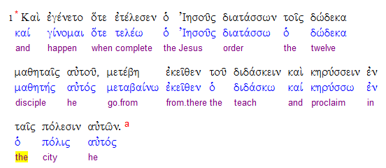

1.  Open in Paratext: PTP project, two resource projects (for example, NIV11 and GNT92), and the source language text. Click in PTP, then go to Windows \> Tile vertically. Paratext will allot equal screen space to the 4 projects, with PTP at the top left. Go to Matthew 11.
2.  Click on the source language text window. If the Greek does not have lemmas (word roots) and glosses showing, click on “View” and check “lemmas” and “glosses.” The Greek should look like this:

3) Modify PTP so Jerusalem is misspelled “Jeruslem” twice (for example, in Hebrews 12:22 and 13:12). In Tools \> Word list, make sure spelling status for “Jeruslem” is marked as unknown. Open Biblical terms (Tools, tool is set to display terms for current verse. Add an exegetical type note in Luke 3:9, for example, select “cut da tree roots” and write “we cut down trees at the trunk, then dig the roots out. Should we change this?”   
4) In Matthew 11, delete two words from verse 1, for example “dey gotta” (9th and 10th words).

5) A second user who can edit the text is needed for the PT live demonstration.

6) Create punctuation error in Luke 3. For example, delete space after a comma in verse 12.

7) Go to Assignments and Progress in PTP for Luke. Make sure the “Complete translation brief” and “Exegesis” task are checked as completed, while other tasks are not checked as completed.

8) Go to File \> Download/Install Resources. If HBKENG and TN are installed on the local computer, delete them.
